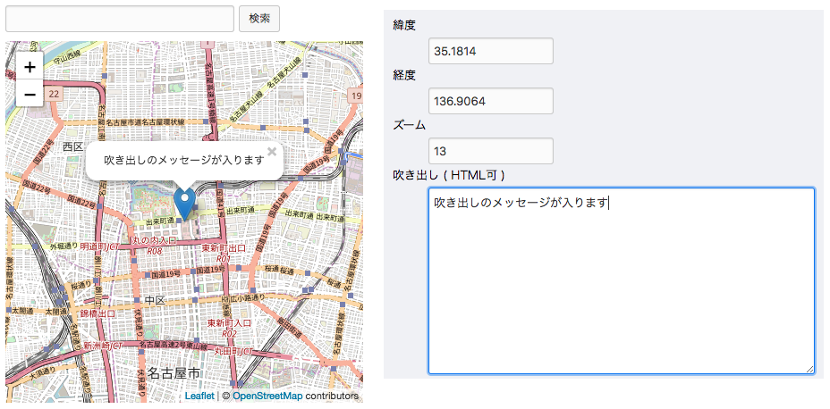

# OSM Editor

## Screenshot



## Demo

[https://rawgit.com/appleple/openmap-editor/master/test/index.html](https://rawgit.com/appleple/openmap-editor/master/test/index.html)

## Usage

js

```js
const editor = new OpenMapEditor('.js-map-editor');
```

html

```html
<table class="formColumnMap {diff} js-osm_editable-container">
  <tr>
    <td class="formColumnMapTd">
      <div class="acms-admin-margin-bottom-small">
        <input type="text" size="34" name="mapSearchTexts[]" value="" class="mapSearchText js-search">
        <input type="button" name="mapSearchButtons[]" value="検索" class="acms-admin-btn-admin js-search-btn">
      </div>
      <div class="acms-admin-gmap-container js-map" style="position:relative;">
        
      </div>
    </td>
    <td class="entryFormFileControl">

      <table class="entryFormImageTable">
        <tr class="textM detail-column-body detail-column-body--{id}">
          <td>
            <dl class="acms-admin-margin-none">
              <dt><label for="unit-map-lat-{id}">緯度</label></dt>
              <dd><input type="text" name="map_lat_{id}" value="35.1814" size="9" id="unit-map-lat-{id}" class="acms-admin-form-width-mini js-lat"></dd>
              <dt><label for="unit-map-lng-{id}">経度</label></dt>
              <dd><input type="text" name="map_lng_{id}" value="136.9064" size="10" id="unit-map-lng-{id}" class="acms-admin-form-width-mini js-lng"></dd>
              <dt><label for="unit-map-zoom-{id}">ズーム</label></dt>
              <dd><input type="number" name="map_zoom_{id}" value="13" size="2" id="unit-map-zoom-{id}" class="acms-admin-form-width-mini js-zoom"></dd>
              <dt><label for="unit-map-msg-{id}">吹き出し ( HTML可 )</label></dt>
              <dd><textarea name="map_msg_{id}" rows="9" id="unit-map-msg-{id}" class="map_msg_id js-msg">吹き出しのメッセージが入ります</textarea></dd>
            </dl>
          </td>
        </tr>
      </table>
    </td>
  </tr>
</table>
```

## Method

update pin location

```js
editor.updatePin({lat, lng, zoom});
```

destroy the editor

```js
editor.destroy();
```

